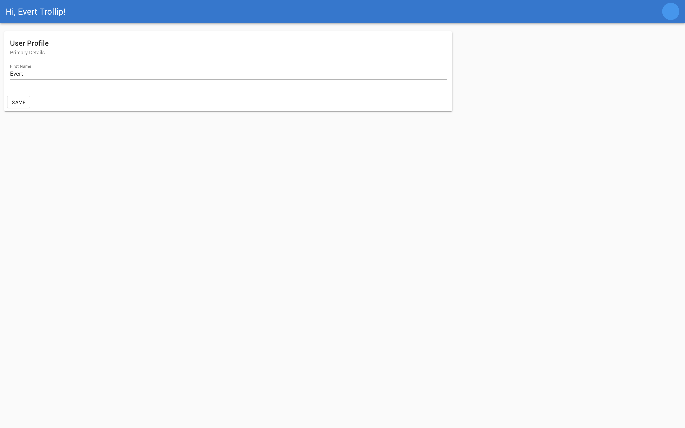

# User Profiler

## Project Details

The following application is a starting template for building a user profile landing page. It is built with Vue and Vuetify. Before getting started, please make yourself familiar with Vue and Vuetify by browsing the following documents:

**Vue Documentation:**

https://vuejs.org/v2/guide/

**Vuetify Documentation:**

https://vuetifyjs.com/en/getting-started/quick-start

**Introductory Videos:**

https://www.vuemastery.com/courses/intro-to-vue-js/vue-instance/
https://www.vuemastery.com/courses/beautify-with-vuetify/getting-started-with-vuetify/

## Instructions

All web applications have one very important feature in common: a page which shows user profile information. At the end of this project, you should be able to see and edit basic user information.

Please see the following document explaining the instructions for this project: [User Profile Application Instructions](https://https://docs.google.com/document/d/14899MkIQAxVc5ZQJSqMQmggTPsOYJazIXKbb3Q4WhQ8/edit?usp=sharing)

## Project setup

In order to get started on your computer, please clone this repository, and run the following command inside the cloned folder:

```bash
npm install
```

When the install is finished, you can run the following,

```bash
npm run serve
```

you shoud then see the following: 


